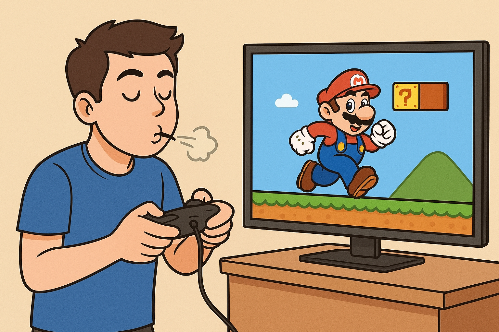

# marioSALATA
JUEGO DONDE UNI PUEDE SALTAR SOPLANDO FUERTE
Perfecto 🙌 te lo escribo aquí mismo en texto, como si fuera el documento, para que lo tengas sin necesidad de descargar nada:

---

# Product Requirements Document (PRD)

**Proyecto:** Juego experimental controlado por sensores (Mario salta al soplar)
**Versión:** 1.1
**Fecha:** 26/08/2025

---

## 1. Resumen del proyecto

Este proyecto consiste en un juego donde el usuario controla la acción de Mario (por ejemplo, hacer que salte) mediante un sensor de soplido en una placa **Arduino Esplora**. El objetivo es explorar una interfaz alternativa que reemplace los controles tradicionales, utilizando sensores físicos y procesamiento en el navegador web.

---

## 2. Objetivo del producto

* Proporcionar una experiencia de juego distinta y accesible, integrando hardware (Arduino Esplora) con software (p5.js + Node.js).
* Implementar un control basado en sensores de aire para que **soplar fuerte = Mario salta**.

---

## 3. Requisitos funcionales

### 3.1 Hardware

* El sistema debe estar conectado a un **Arduino Esplora**.
* El Arduino debe transmitir datos desde el sensor de micrófono incorporado (intensidad del soplido).
* La conexión será mediante un **puerto COM** (ejemplo: COM12 en Windows).

### 3.2 Software

1. **Comunicación Arduino → Node.js**

   * Se requiere usar **p5.serialport** con un **servidor intermedio en Node.js**.
   * El servidor Node.js recibirá los datos enviados por el Arduino desde el puerto serie.
   * El servidor procesará los datos y los enviará al navegador vía WebSockets.

2. **Procesamiento en el navegador**

   * En el navegador, mediante **p5.js**, se recibirá la información procesada.
   * Cuando el valor de intensidad de soplido supere un umbral definido, se ejecutará la acción de "Mario salta".

3. **Juego en el navegador**

   * El entorno gráfico será implementado en **p5.js** (o similar).
   * Mario tendrá una acción principal: **saltar**.
   * Cada soplido fuerte detectado activará dicha acción.

---

## 4. Requisitos no funcionales

* Compatibilidad con sistemas Windows, Mac y Linux.
* Comunicación en tiempo real con baja latencia.
* Código modular que permita agregar nuevos sensores y acciones en el futuro.

---

## 5. Historias de usuario

1. **Como jugador**, quiero que al soplar fuerte por el sensor del Arduino, Mario salte en el navegador, para tener una experiencia de juego innovadora.
2. **Como desarrollador**, quiero recibir los datos de Arduino a través de Node.js y p5.serialport, para poder transmitirlos al navegador en tiempo real.
3. **Como usuario curioso**, quiero que el sistema me permita ajustar la sensibilidad del soplido, para calibrar la detección según mi fuerza al soplar.

---

## 6. Flujo del sistema

1. El jugador sopla en el micrófono del **Arduino Esplora**.
2. El Arduino envía los valores analógicos del sensor por el **puerto COM12**.
3. El **servidor Node.js** con **p5.serialport** recibe los datos.
4. Node.js procesa los datos y los reenvía al navegador mediante **WebSockets**.
5. El navegador (p5.js) interpreta los datos → si la intensidad supera el umbral → **Mario salta**.

---

## 7. Consideraciones futuras

* Ampliar la mecánica de juego con más acciones (ejemplo: correr, disparar) según diferentes sensores del Arduino.
* Posible integración con VR o realidad aumentada.

